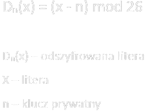

### Dokumentacja 11.12.23
# Skrypt który tworzy szyfr cezara.
### Język programowania który zastosowałem to Python z uwagi na prostotę i niski próg wejścia.

```python
ALPHABET = ' !ABCDEFGHIJKLMNOPQRSTUVWXYZ'
KEY = 3
```
###### Na samym początku zobowiązani jesteśmy do zadeklarowania 2 zmiennych, jedna z nich będzie w sposób statyczyny przechowywać angielski alfabet, druga zaś klucz potrzebny do szyfrowania.
###### Szyfr Cezara jest szyfrowaniem symetrycznym, a więc potrzebujemy jednego klucza który będzie nam potrzebny do szyfrowania naszej wiadomości oraz odszyfrowywania jej, ten klucz jest zwany kluczem prywatnym (private key).
###### Szyfrowanie odbywa się za pomocą zastępowania znaków naszej wiadomości znakami zadeklarowanymi w zmiennej o nazwie ALPHABET. Jednak najpierw musimy wyznaczyć wzór według którego algorytm będzie szyfrował nasze wiadomości.

###### Następnie implementujemy rozwiązanie w postaci poniższej funkcji szyfrującej przyjmującej tekst do zaszyfrowania.
```python
def caesar_encrypt(plain_text):
    cipher_text = ''
    plain_text = plain_text.upper()
    for c in plain_text:
        index = ALPHABET.find(c)
        index = (index + KEY) % len(ALPHABET)
        cipher_text = cipher_text + ALPHABET[index]
    return cipher_text
```
###### W ciele funkcji deklarujemy zmienną cipher_text która będzie przechowywała nasz szyfr oraz przypisujemy jej pusty ciąg znaków.
###### Następnym krokiem będzie zdefiniowanie na zmiennej plain_text który przyjmuje funkcja metody upper() która pozwoli pominąć rozróżnianie szyfru ze względu na wielkość liter. Potem używając pętli iterujemy po njaszej wiadomości przekazanej do funkcji w postaci plain_text. W pętli deklarujemy nową zmienną index przechowującą index każdej z liter naszej wiadomości do zaszyfrowania. Następnie nadpisujemy zmienną index i wykonujuemy działanie szyfrujące według wzoru opisanego powyżej. Kolejnym krokiem jest utworzenie zmiennej cipher_text która będzie szyfrowała kolejno każdą z liter naszej wiadomości. Na końcu zwracamy naszą zmienną szyfr która przechowuje zaszyfrowany text.

###### Aby odszyfrować naszą wiadomość która została już zaszyfrowana musimy wyznaczyć funkcję odwrotną do funkcji szyfrującej. To będzie funkcja zamieszczona poniżej.
